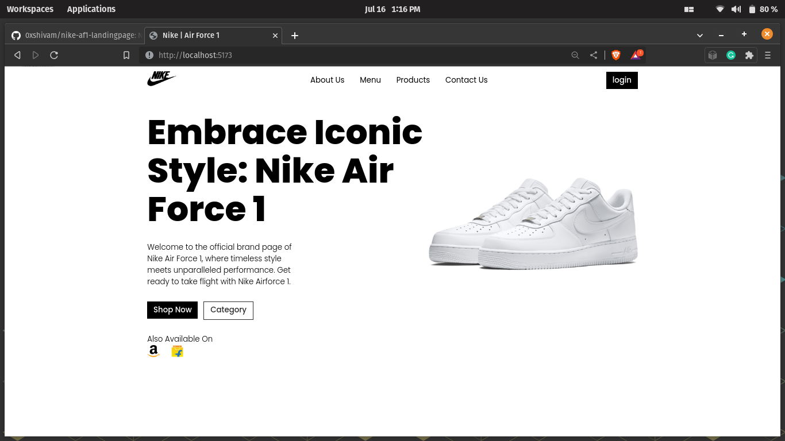

Installing into your local machine:
1. Copy the repo link.
2. Clone the repo into your local machine and cd into that file directory.
3. After that Run the command: npm install.
4. After installation run the command: npm run dev (this will run the react app on a local server)

Preview:
Nike AF1 landing page</img>
